# Oriented Bounding Boxes through Faster RCNN

## Extending Faster R-CNN for Oriented Bounding Boxes

### Modifications made
- Added a new target `thetas` in the dataloader to store the orientation of the bounding boxes.
Modified the `FastRCNNPredictor` to include the orientation of the bounding boxes.
- Modified the `RPN` to prepare target for thetas for both predicted and ground truth boxes.
- Modified loss functions to include the orientation loss.

Note:
- Bin size = 1 corresponds to regression loss. Otherwise it is classification loss.

For evaluation, 
- IOU function is modified to include the orientation of the bounding boxes.
- MAP is calculated using the modified IOU function.
- Additional metrics like Precision, Recall are calculated.

### Hyperparameters
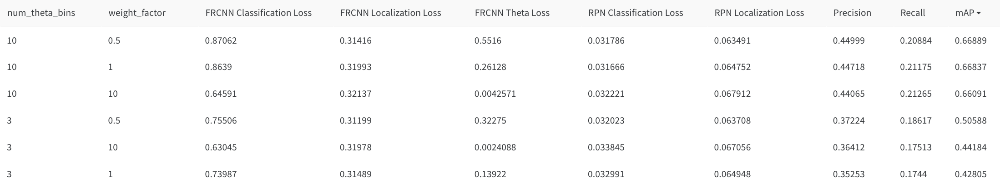
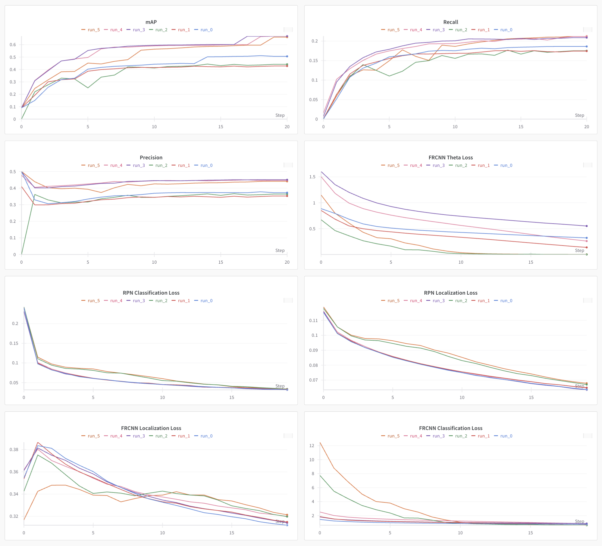

### Augmentations
Randomized flipping augmentations are used to augment the dataset.
```
mAP: 0.3387 | Precision: 0.4575 | Recall: 0.0910
```
The scores are worse thatn training without augmentations. As the model learns to detect text in natural orientations (e.g., horizontal, diagonal), flipping can introduce unrealistic orientations that are rare in real-world scenes causing the model to perform poorly.

### Results
```
Class: background
  AP: nan, Precision: 0.0000, Recall: 0.0000
Class: text
  AP: 0.6001, Precision: 0.8968, Recall: 0.4127
Mean Average Precision (mAP): 0.6001
Mean Precision: 0.4484
Mean Recall: 0.2064
```


### Visualizations
| Ground Truth | Predicted  | Ground Truth | Predicted |
|:--------------:|:------------:|:--------------:|:------------:|
| 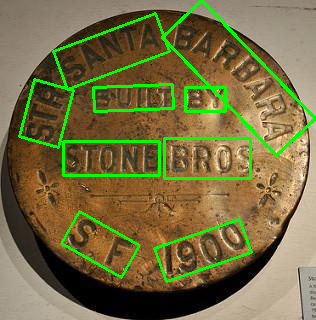 | 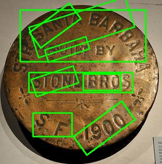 |  | 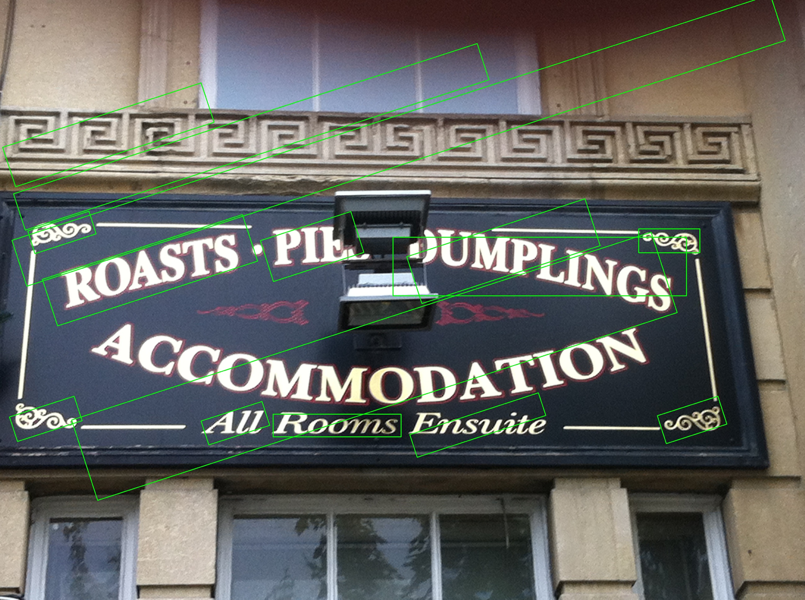 |
|  |  | 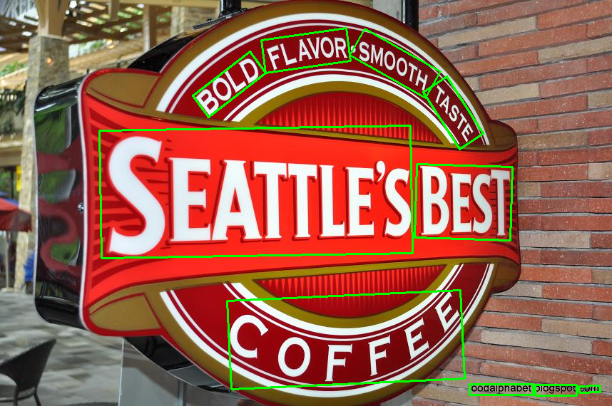 | 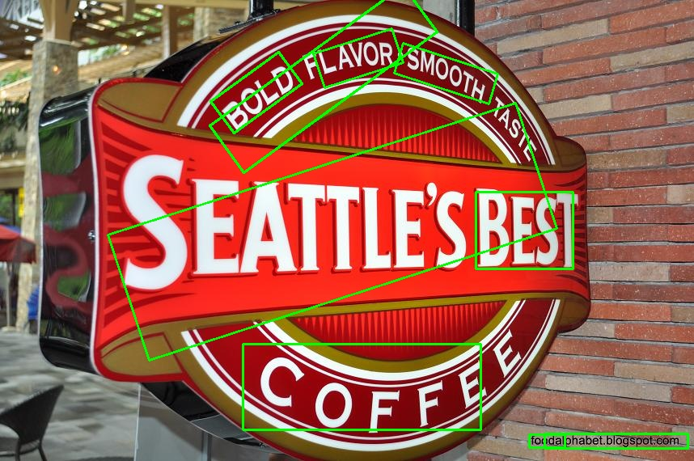 |
| 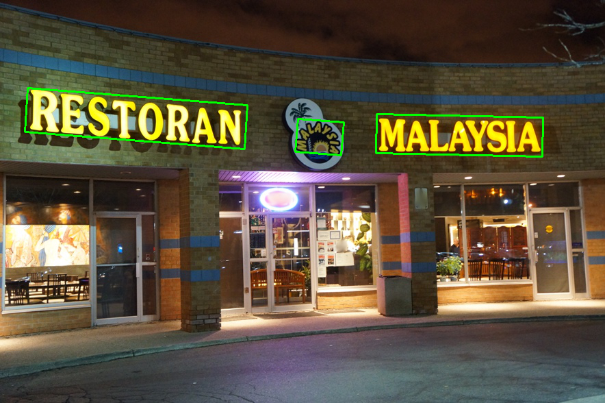 | 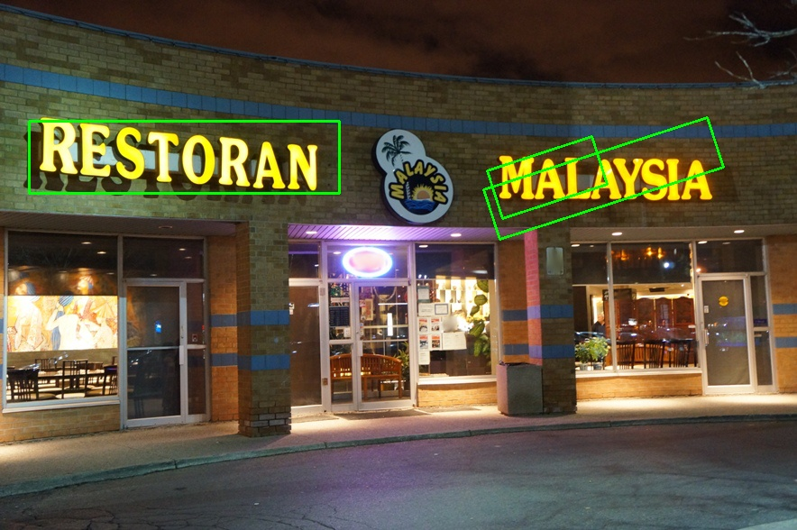 | 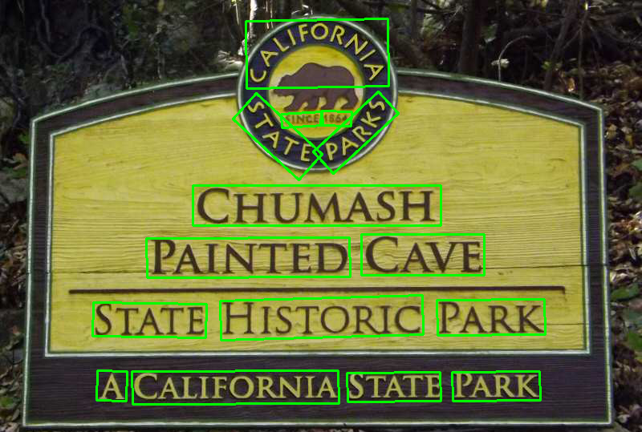 | 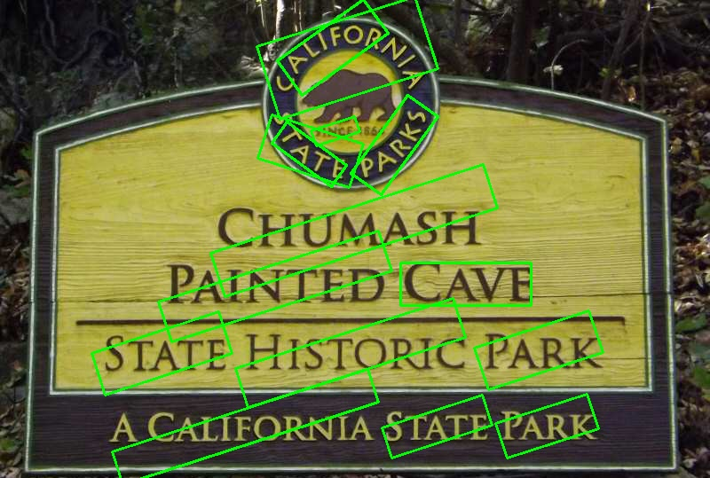 |
| 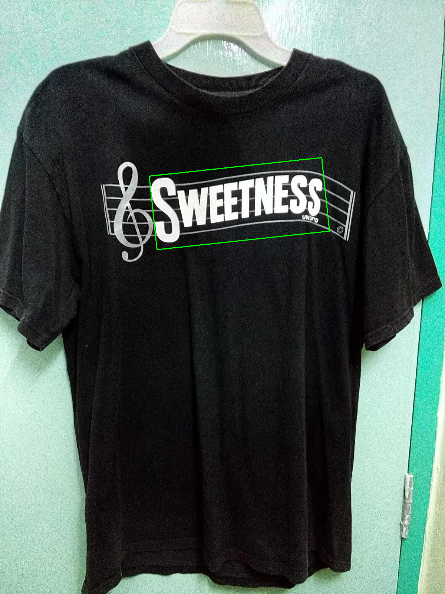 | 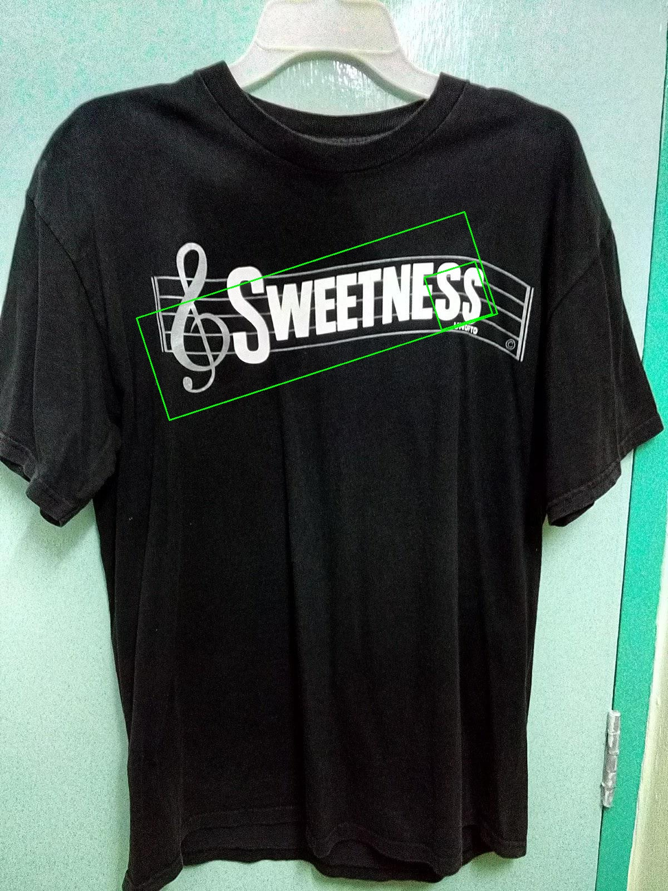 |  | 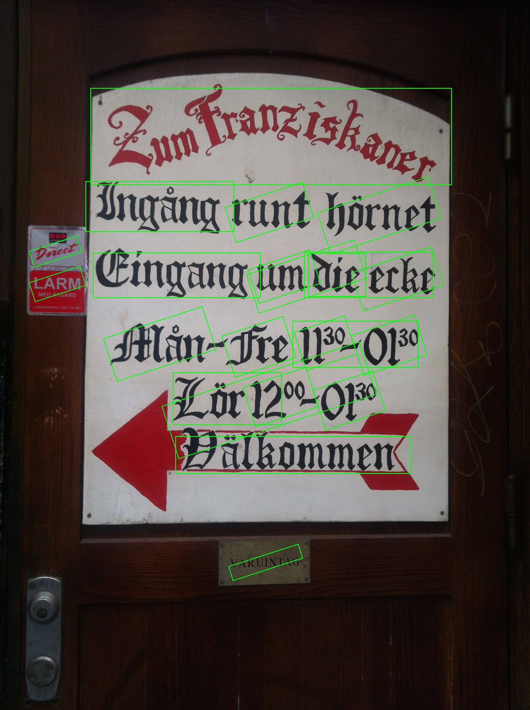 |
| 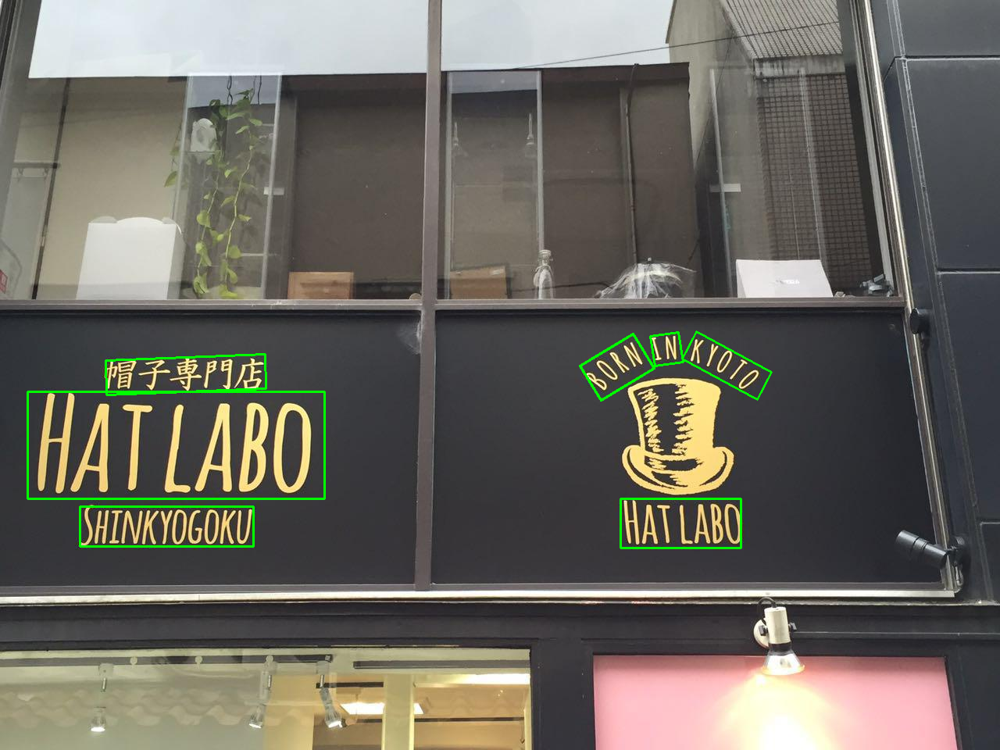 | 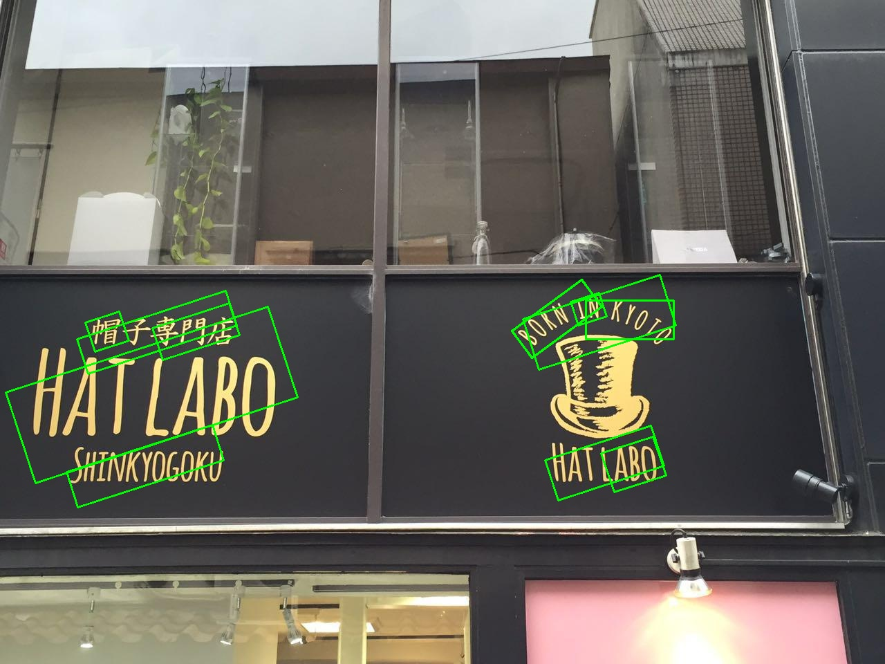 | 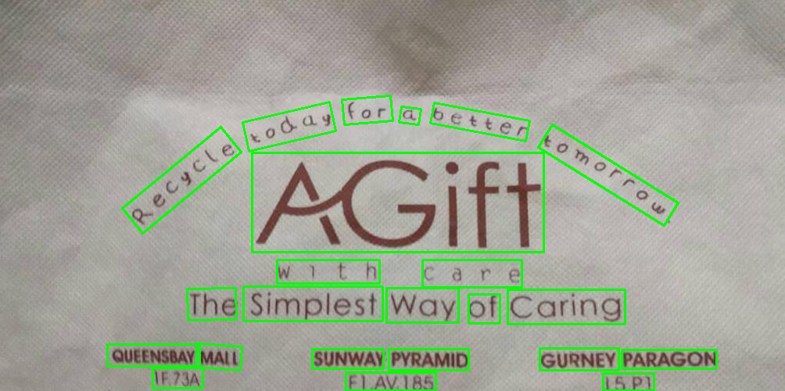 | 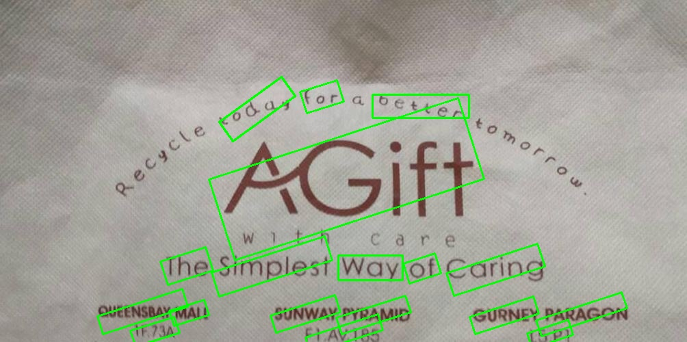 |


### Analysis
- Failure cases: 
    - Detection of curved text is not accurate. This is due to the limitation of rectangular bounding boxes. 
    - The model will aslo fail to detect occulded text. 
    - Text with very high aspect ratio may not be detected accurately due to the limitations of the anchor boxes.
- Architectural Changes to improve bounding box detection: 
    - Use of rotated bounding boxes as anchor boxes.
    - Using a different backbone network like ResNet-101 or ResNeXt.
- Alternative methods to improve accuracy:
    - Non-maximum suppression (NMS) can be used to remove redundant bounding boxes.
    - Using a different loss function like GIoU loss.
- Convergence Behavior:
    - The model converges after 15 epochs.
- Challenges faced:
    - Long training time.